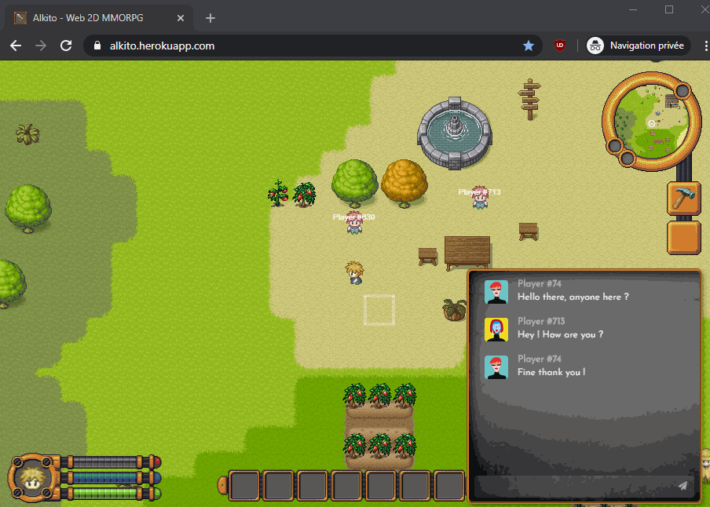
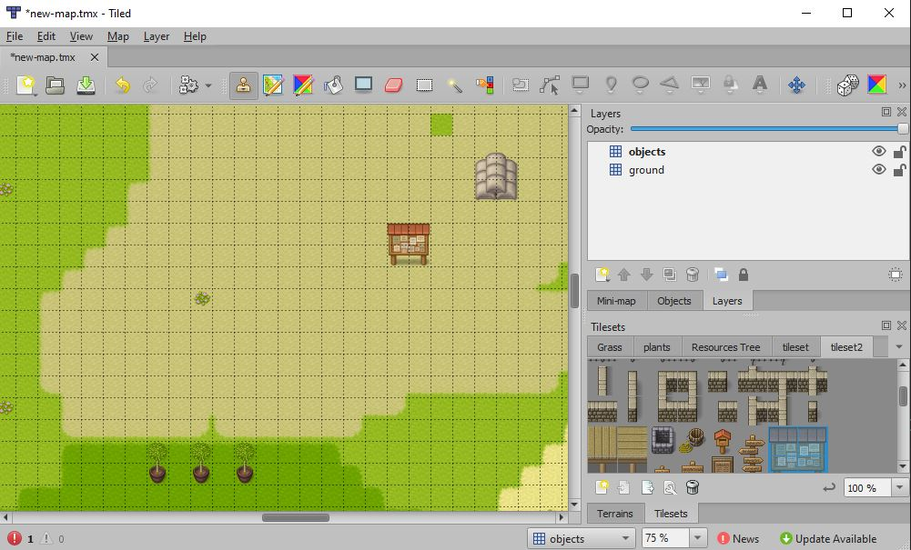

During the COVID crysis, I decided to take a new challenge: create a MMORPG with javascript. I had plenty of time, and
building a game was something that had been running around in my head for quite some time.

I decided to share my journey through the development of my MMORPG with javascript (well, Typescript actually): *Alkito*.

Is it a Devlog, is it a tutorial ? Both, probably. 

This is what have been done so far:



So, ready for this ? Let's dive in !


## The Stack™

Knowing I'm a frontend developer, I decided to use this stack for my MMORPG:
- **Javascript** (actually Typescript) for the Game Core.
- **Phaser.js** for the Game engine.
- **React.js** for the Game UI.
- **node.js** for the server.

We'll definitely come back to each of these tech later.


## Day 1: God Created the Earth (with Tiled)

First thing first, I needed a map for my game.
There are many ways to manage this, but the easiest is probably [Tiled](https://www.mapeditor.org/).

Tiled is an open-source "tiled" map editor. It will allow us to "paint" a map with tiles (dirt, sand, grass, walls, ...) and export it to be used in our game.

There are a lot of tutorials on the web to create a map with Tiled, but here are the steps:
1. Create a new map (I chosed a 32px*32px size for each tile).
2. Import a Tileset image (you can find plenty on the internet, but choose one with 32px tiles).
3. Create a layer `ground` and paint ground tiles.
4. Create a layer `objects` and paint additional object tiles.

You should have something like this:


5. Export the map in JSON (File > Export As... > Type: JSON map files (.JSON)).

You should now have a JSON map, and a image tileset (the one you imported in Tiled).


### Import map in Phaser.js

Fortunately, Phaser.js supports Tiled JSON map out of the box !
We first need to load the JSON map as a `tilemapTiledJSON`, and the tileset as a `spritesheet`:

```javascript
// This is our main scene
export default class WorldScene extends Phaser.Scene {
  constructor() {
    super('WorldScene');
  }

  preload() {
    // load JSON map
    this.load.tilemapTiledJSON('map', 'assets/my-map.json');
    // load tileset image
    this.load.image('myTileset', 'assets/tileset.png');
  }

  create() {}
}
```

To create the map, we then need to create a *tilemap*, link the tileset to this map, then create our two layers `ground` and `objects`.

```javascript
// This is our main scene
export default class WorldScene extends Phaser.Scene {
  ...

  create() {
    // Create the map. 'map' is the key of the resource created in the preload
    const map = this.make.tilemap({ key: 'map' });

    // link the tileset to the map.
    // - 'tileset' refers to the tileset name used in the JSON map.
    // - 'myTileset' is the image's key loaded in Phaser.js
    const tileset = this.map.addTilesetImage('tileset', 'myTileset');

    // create the ground layer with our tileset
    const mapLayer = this.map.createStaticLayer('ground', tileset);
    // create the objects layer
    const mapLayer = this.map.createStaticLayer('objects', tileset);
  }
}
```