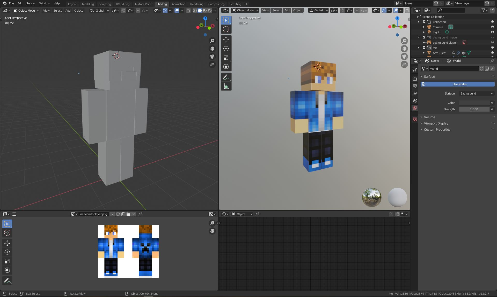
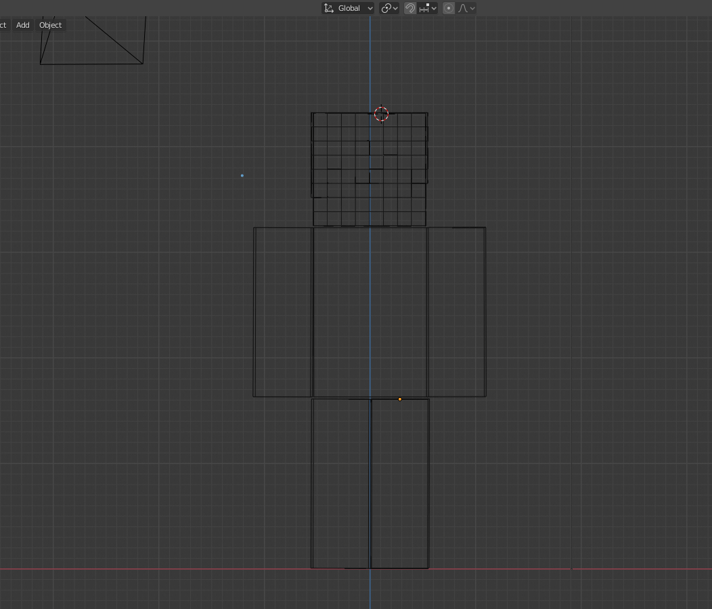
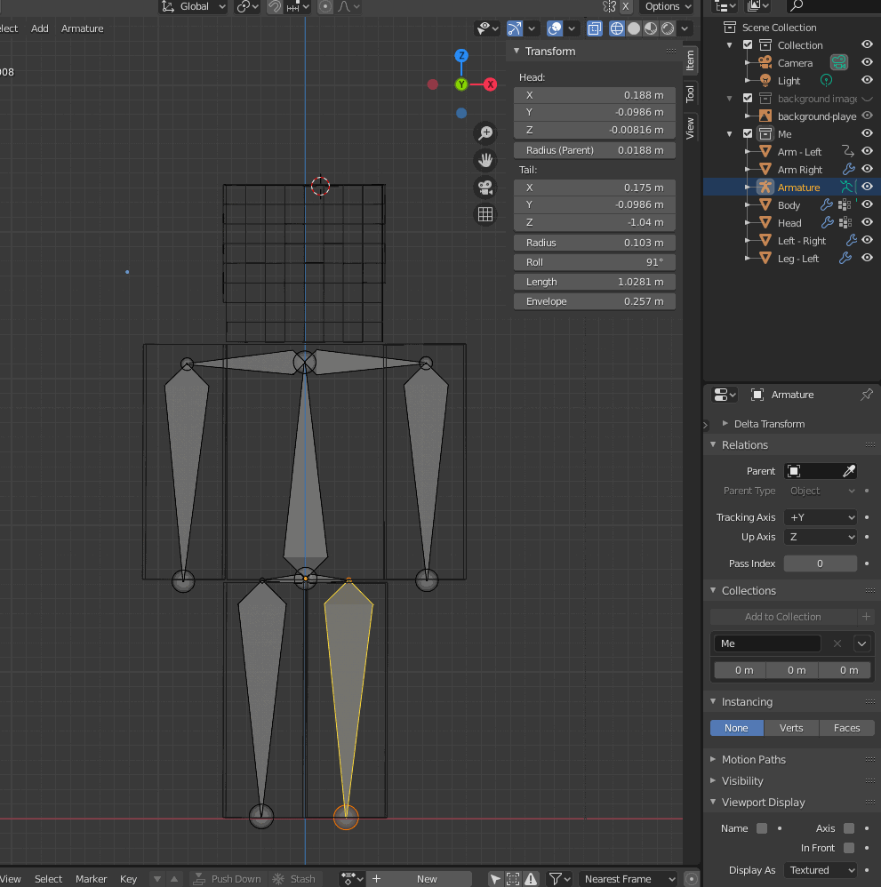
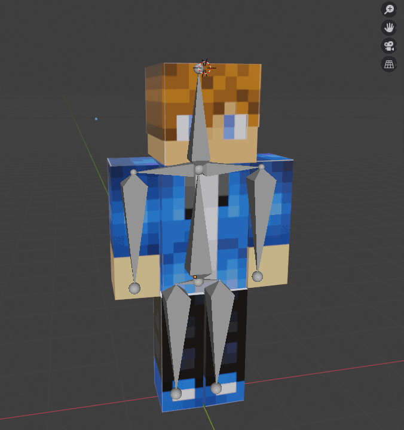
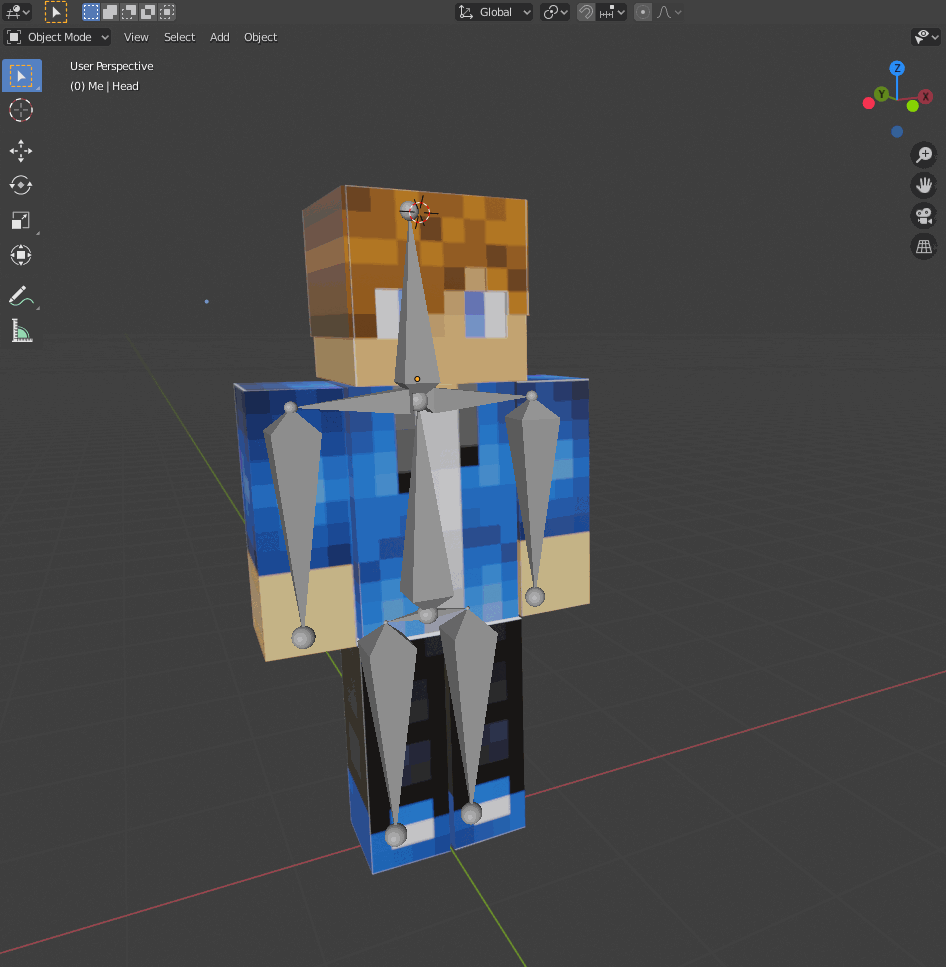
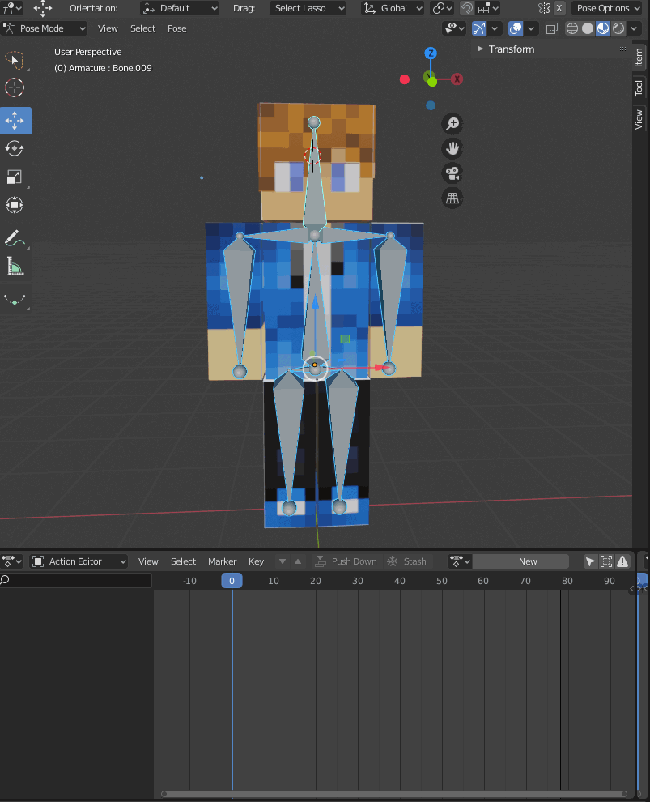
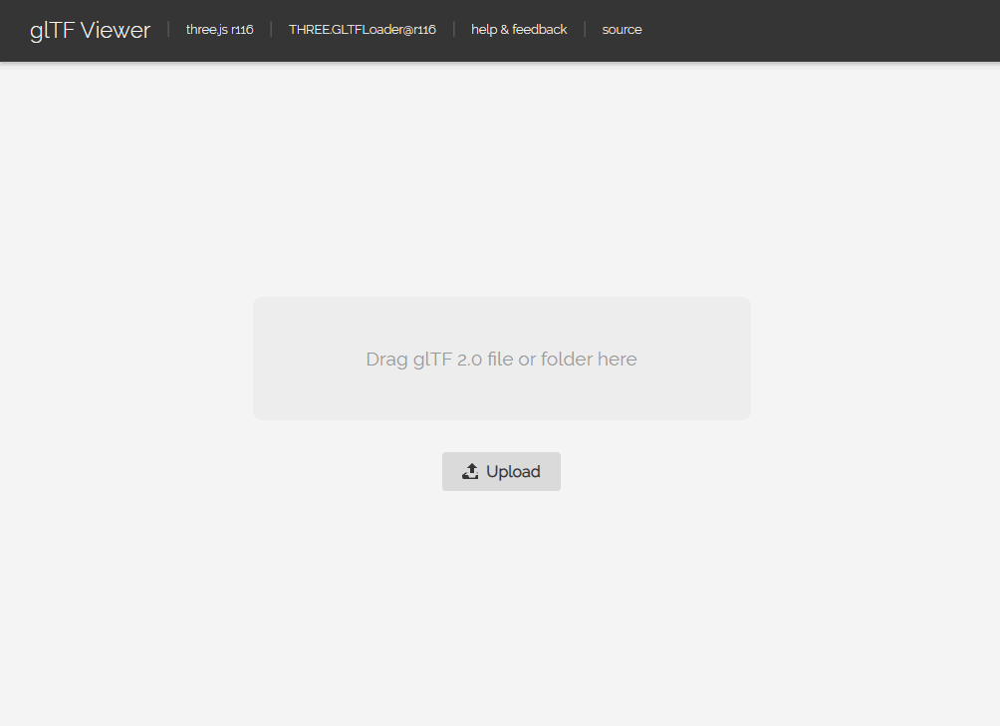

After creating this 3D header for my blog (the one at the top of the screen) with react-three-fiber and Blender, I thought that
it would be useful to share my work.
In this first post, we will see how to create an animation (armature and bones) for a 3D model, then export the glTF file with animation.

## Create the Blender model

First, we need a 3D model in Blender. I created a really simple model, inspired by Minecraft (because I love Minecraft, or because I'm terrible at 3D modeling, don't know...):

## Create the armature

In Blender, you can create a armature for any 3D model. This armatures is composed of "bones", which will affect your 3D model when animated.
These steps are called "rigging" (create the armature) and "skinning" (affect your armature/bones to your model).

### Rigging your model

Rigging a model is simple: you just need to create an armature (Add > Armature) and add bones to your model. You can easily create bones from parent bone with the extrude feature:

You should have a complete skeleton after the whole rigging process. To create new child bones, extrude them from parent bone with the "extrude" feature.
You can also use the *scale* and *move* tools.

Note that, since last Blender release, the *x-ray* feature (to always see bones through mesh) has been renamed. 
Select your armature in object mode, then in the right panel, select `Viewport Display > In Front`.

### Skinning your model

I won't go too deep, because skinning is a really hard task and, again, you can find a lot in resources in the web.
Right know, our armature is not connected to our 3D model. In other words, it doesn't "affect" our model.
Proof is that if you decide to rotate one of your bone, it will not move your 3D model.

To link this armature to our model, select your 3D model, then your armature, and right click: `Parent > Armature Deform > With Automatic Weights`

The "Automatic Weights" feature will magically links the mesh *around* each bone. It means that each bone will affects the vertices around itself.
You can manually edit this with the "Weight Paint" view: select the armature first, then your model, then select the "Weight Paint" view.
You can then *add* or *remove* weight for each bone (Alt + click to select a specific bone): blue means it doesn't affect the mesh, red means it affects it a lot.

Anyway, we should now have an armature linked to our mesh. You can now go to the "Pose Mode" after selecting your armature,
 then rotate a bone to see your 3D model moving !

## Create an animation in Blender

Now we have our armature setup, it's a breeze to animate your model. Let's go in "Pose Mode", then open the "Dope Sheet > Action Editor" view in another split view.
The action editor is a keyframe based editor. It means you'll be able to set a keyframe at time 'T' and save its state (rotation, position, whatever...).

To insert a new keyframe, select and rotate a bone (in "Pose mode"), then `right click > Insert Keyframe > Rotation`. 
It will create a keyframe, which will saves the bone's rotation at this moment.

After moving the nowline and set new keyframes for each bone, you should have a complete animation. You can play your animation with the "Space" shortcut.

Don't forget to set the start/end of your animation

## Export to glTF

It's time to export our Blender 3D model to glTF.
**Be sure to use the Blender v2.82a, it fixed a lot of issues with glTF export**.

Click on `File > Export > glTF 2.0`.
You have a bunch of options at the right. The main one is the format (glTF binary or separated files). You can leave default settings for now.

After exporting your glTF model, you can import in in a glTF viewer like this one: [Online glTF viewer](https://gltf-viewer.donmccurdy.com/).
Note that if you have to import **all** assets in the viewer (.gltf file, .bin and your textures).

If you created only one animation, you should see your default animation playing in the viewer:

And that's it !
In the next post, we will see how to import this glTF file in react-three-fiber, and play our animation in the browser.

Stay tuned !